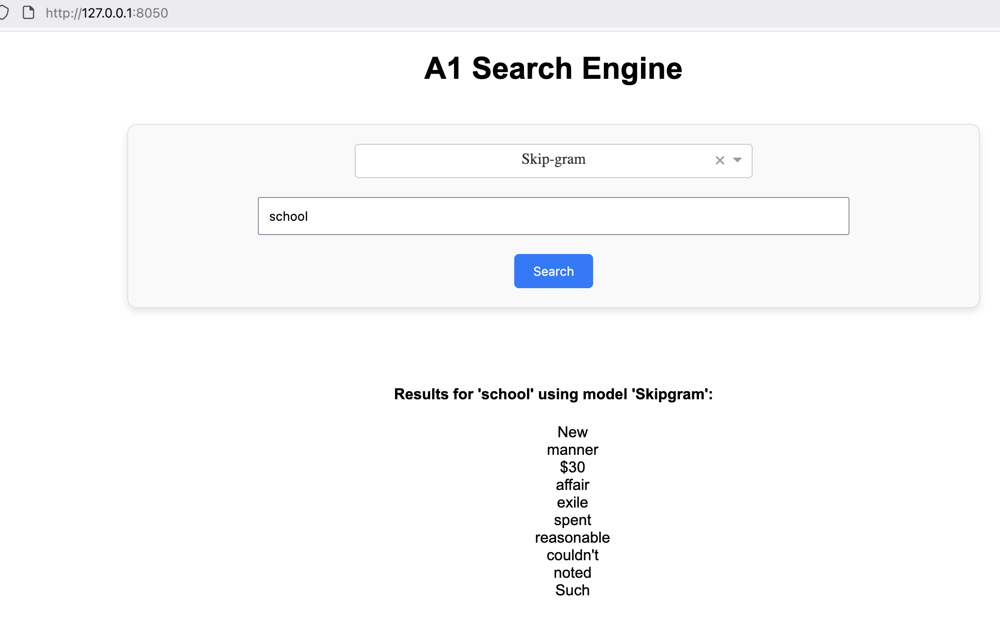
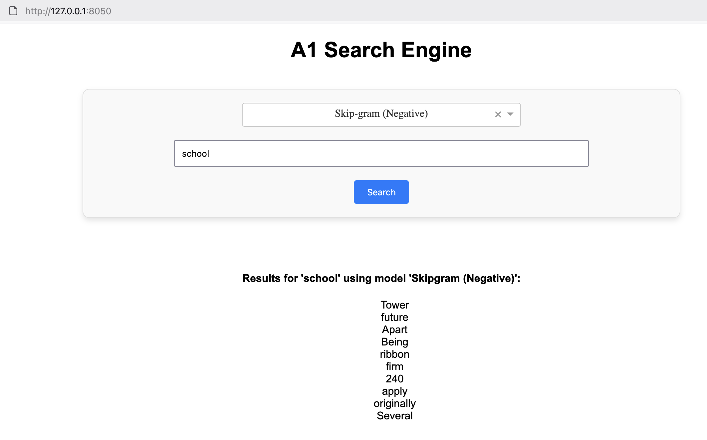
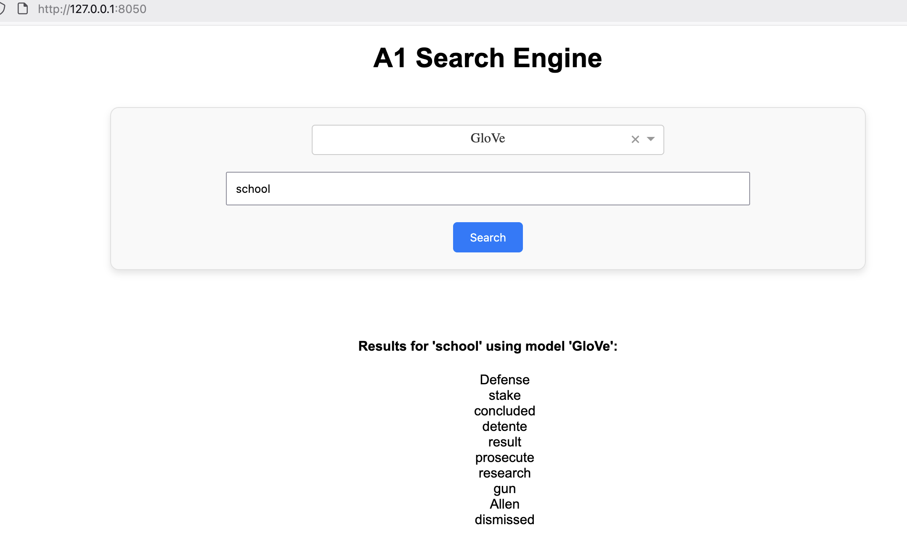

# A1 : That's what I like 

## Folder Structure

```
A1/
├── README.md
├── app/
│   └── app.py - application code
├── code/
│   ├── a1.ipynb
│   ├──class/
│   │   ├── 01 - Word2Vec (Skipgram) from Scratch.ipynb
│   │   ├── 02 - Word2Ve (Negative Sampling) from Scratch.ipynb
│   │   ├── 03 - GloVe from Scratch.ipynb
│   │   └── 04 - GloVe (Gensim).ipynb
├── data/ (data used in model training)
├── model/ (pickled models)
└── resources/
    └── A1_That_s_What_I_LIKE.pdf
```

## A1 Search Engine Results








## How to run app

1. Run the jupyter notebook [a1.ipynb](code/a1.ipynb) to create the models 

2. Execute app.py 
``` bash
uv run app/app.py 
```