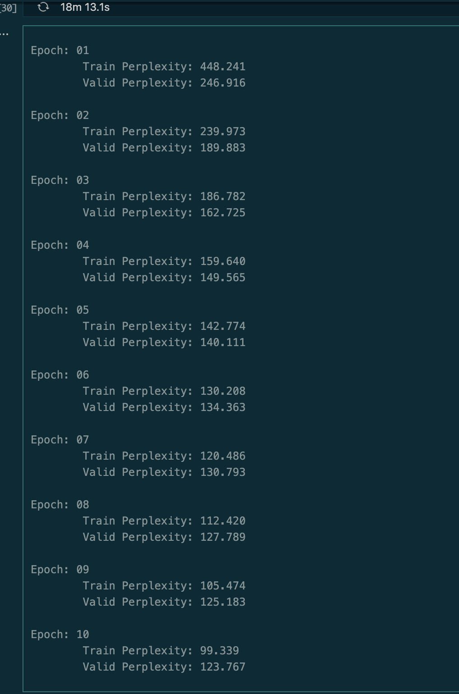
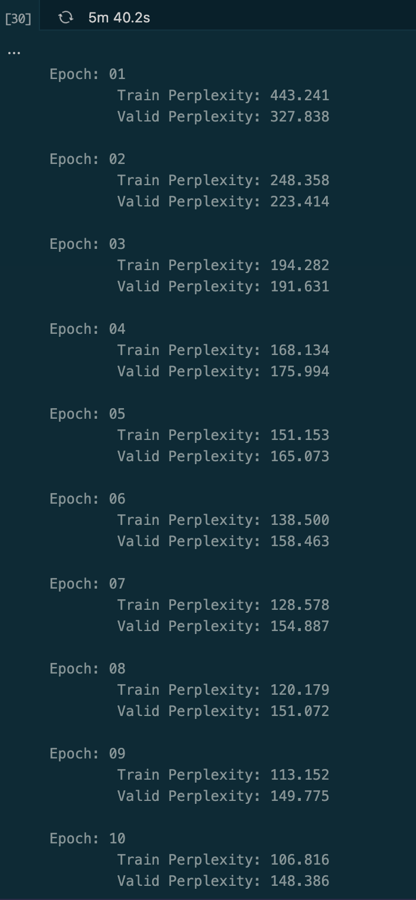
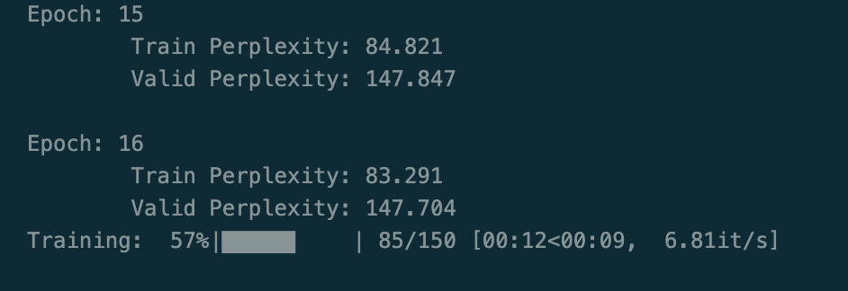

# NOTES
## CPU / GPU Clock

What is a Clock?
A clock is an electronic signal that synchronizes all operations in a processor. It "ticks" billions of times per second.

```
Clock Signal:
 ┌──┐  ┌──┐  ┌──┐  ┌──┐  ┌──┐
 │  │  │  │  │  │  │  │  │  │
─┘  └──┘  └──┘  └──┘  └──┘  └──

Each tick = one "cycle"
```

Clock Speed (Frequency)
Measured in Hz (Hertz) = cycles per second

Unit	Meaning	Example
MHz	Million cycles/sec	1000 MHz = 1 billion ticks/sec
GHz	Billion cycles/sec	3.5 GHz = 3.5 billion ticks/sec

What Happens Each Tick?
Each clock cycle, the processor can:
- Fetch an instruction
- Execute a calculation
- Move data

Faster clock = More operations per second = Faster processing

### Real-World Example (Your M3 Mac)

| Component | Clock Speed     | Meaning                        |
|-----------|----------------|--------------------------------|
| M3 CPU    | ~3.0-4.0 GHz   | 3-4 billion cycles per second  |
| M3 GPU    | ~1.0-1.4 GHz   | 1-1.4 billion cycles per second|

From your powermetrics output:

```
GPU HW active frequency: 1002 MHz = 1.002 GHz
```
Your GPU was running at ~1 billion cycles per second.

### Why GPU Clock is Lower Than CPU?

| Aspect    | CPU                | GPU                        |
|-----------|--------------------|----------------------------|
| Clock     | 3-5 GHz (fast)     | 1-2 GHz (slower)           |
| Cores     | 8-24 cores         | 1000s of cores             |
| Strategy  | Few fast cores     | Many slow cores            |

GPU compensates for slower clock with massive parallelism.

Analogy:

```
CPU: 8 expert chefs cooking at high speed
     → Great for complex, sequential recipes

GPU: 1000 line cooks working together
     → Great for making 1000 identical dishes at once
```

Clock Speed vs Performance:
⚠️ Higher clock ≠ always faster

Other factors matter:
- Number of cores
- Instructions per cycle (IPC)
- Cache size
- Memory bandwidth
- That's why an M3 at 3 GHz can beat older chips at 4 GHz.

---

## Pyspark vs Pandas

| Feature               | Pandas        | PySpark         | Polars         |
|-----------------------|---------------|-----------------|---------------|
| Memory Efficiency     | Moderate      | High            | Very High     |
| Parallelism           | No            | Distributed     | Multi-threaded|
| Dataset Size Handling | Small-Medium  | Large-Very Large| Medium-Large  |
| I/O Performance       | Moderate      | High            | High          |
| Real-Time Processing  | Poor          | Excellent       | Moderate      |
| Ease of Use           | Excellent     | Moderate        | Good          |
| Columnar Optimization | Limited       | Good            | Excellent     |


## GPU vs CPU

When you run deep learning code on your Mac, you can use either the CPU or the GPU (Apple’s Metal Performance Shaders, or MPS). Here’s how they differ in terms of “quietness” and system behavior:

1. CPU (Central Processing Unit):

- The CPU is designed for general-purpose tasks and is always running, even when you’re not training models.
- When you use the CPU for training, it works hard, but the workload is spread out and usually doesn’t push the system to its thermal or power limits.
- As a result, your Mac stays cool and quiet—fans rarely spin up, and you don’t notice much extra noise or heat.


2. MPS (Apple GPU):

- The GPU is specialized hardware for parallel computations, like those in deep learning.
- When you use MPS, the GPU is heavily utilized, which can generate more heat.
- To keep the system cool, your Mac may increase fan speed, which makes it noisier.
- The GPU can also draw more power, which may make your laptop warmer to the touch.

#### Why does this happen?

- GPUs are much more powerful for certain tasks, but they also consume more energy and generate more heat when fully loaded.
- The system’s cooling (fans) responds to this by spinning up, which you hear as noise.
- On CPU, the workload is less intense for these tasks, so the system remains quieter.


Summary Table:

| Device | Performance | Heat/Noise | Use Case                        |
|--------|-------------|------------|---------------------------------|
| CPU    | Slower      | Low        | Everyday tasks, small models    |
| MPS    | Faster      | Higher     | Large models, faster training   |


In practice:

If you want a quiet system and don’t mind slower training, use the CPU. If you want faster training and don’t mind some fan noise or heat, use the GPU (MPS).

### Apple Silicon (M1, M2, etc.) chips have two types of CPU cores: efficiency cores and performance cores.

#### Performance cores (P-cores):

- Designed for high-speed, demanding tasks (like compiling code, training models, gaming).
- Run at higher clock speeds and deliver maximum performance.
- Use more power and generate more heat.

#### Efficiency cores (E-cores):

- Designed for light, background, or everyday tasks (like web browsing, email, system processes).
- Run at lower clock speeds and use less power.
- Help extend battery life and keep the system cool.

Summary:
- Performance cores = fast but power-hungry.
- Efficiency cores = slower but energy-saving.
- The system automatically uses the right mix for your workload to balance speed and battery life.

** Rough comparison - model training get completed 5x faster in GPU than CPU. It's mainly cause CPU automatically balances speed and battery life for efficiency and peformance. While in GPU, it can be utilized to full capacity

 only about 10 epochs in 17 minutes

   within 5 minutes about 15 epochs

## Why perplexity is higher in gpu training on MAC ?

Perplexity can sometimes be higher when training on GPU (MPS or CUDA) compared to CPU for several reasons:

1. Numerical Precision Differences: GPUs (especially Apple MPS and some CUDA setups) often use lower-precision floating point (float16 or mixed precision) for speed, which can introduce small rounding errors. These errors can accumulate, especially in deep models, leading to slightly different (sometimes worse) loss and perplexity compared to CPU (which usually uses float32 by default).

2. Randomness and Non-Determinism: GPU operations (like parallel reductions, atomic operations, and some math libraries) are often non-deterministic. This means that even with the same seed, you might get slightly different results on GPU vs. CPU, which can affect training dynamics and final perplexity.

3. Batching and Data Loading: If your data pipeline or batch loader behaves differently on GPU (e.g., due to parallel data loading, shuffling, or prefetching), the model may see data in a different order, which can affect convergence and perplexity.

4. Implementation Bugs or Device Mismatch: If some tensors or the model are accidentally left on the wrong device, or if there are silent device mismatches, this can cause unexpected behavior or degraded performance.

What to do:

- Make sure all tensors and the model are on the same device.
- Set seeds for reproducibility, but know that perfect determinism is hard on GPU.
- If using MPS (Apple GPU), be aware that it is still less mature than CUDA and may have more subtle precision issues.
- For critical experiments, compare results on both CPU and GPU, and consider using float32 everywhere for consistency.

In summary: Slightly higher perplexity on GPU is usually due to precision and non-determinism, not a fundamental problem with your code. If the difference is large, check for device mismatches or bugs. If it’s small, it’s expected.


