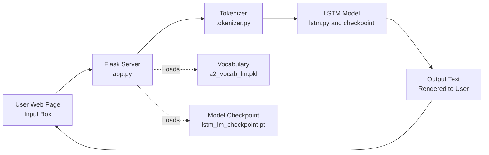

# A2 : Language Model

## Task 3. Text Generation - Web Application Development - Develop a simple web application thatdemonstrates the capabilities of your language model. (2 points)

1) The application should include an input box where users can type in a text prompt.
2) Based on the input, the model should generate and display a continuation of the text. For example,
if the input is ”Harry Potter is”, the model might generate ”a wizard in the world of Hogwarts”.
3) Provide documentation on how the web application interfaces with the language model.

### How the Web Application Interfaces with the Language Model

The web application is built using Flask and provides an interactive interface for users to generate text continuations using the trained LSTM language model. Here is how the integration works:

1. **User Input:** The user enters a text prompt into the input box on the web page.
2. **Request Handling:** When the user submits the prompt, the Flask backend receives the request and processes the input.
3. **Model Loading:** On startup, the Flask app loads the LSTM model weights from the checkpoint file (`lstm_lm_checkpoint.pt`) and the vocabulary object from the pickle file (`a2_vocab_lm.pkl`).
4. **Tokenization:** The input prompt is tokenized using the custom `basic_english_tokenizer` to convert the text into tokens compatible with the model's vocabulary.
5. **Numericalization:** Tokens are mapped to their corresponding indices using the loaded vocabulary.
6. **Text Generation:** The processed input is fed into the LSTM model, which generates a sequence of output tokens based on the prompt and model parameters. The generation process uses temperature sampling for diversity and stops when an end-of-sequence token is produced or the maximum length is reached.
7. **Decoding:** The output token indices are converted back to words using the vocabulary's index-to-token mapping.
8. **Post-processing:** Special tokens like `<unk>` are replaced with `[[UNKNOWN]]` for clarity, and the generated text is formatted for display.
9. **Response Rendering:** The generated text is rendered on the web page using a Jinja2 template. The `safe` filter is used to allow proper HTML formatting while ensuring user input is sanitized.

#### Web Application & Language Model Architecture


<!-- Img  

-->

This architecture allows the web application to serve real-time text generation requests using the trained language model, providing an interactive demonstration of its capabilities.


## Folder structure
```
A2/
├── app/
│   └── app.py - Web Application code using Flask framework 
│   └── lstm.py - LSTMLanguageModel class
│   └── tokenizer.py - basic_english_tokenizer function
│   └── vocab.py - Vocab class
├── model   - models and checkpoint location
│   └── a2_vocab_lm.pkl - Vocab pickle file
│   └── lstm_lm_checkpoint.pt - Checkpoint for LSTM model
├── code
│   └── class - notebooks from NLP class
│       ├── figures
│       │   └── LM.png
│       └── LSTM LM.ipynb
├── data/  
│   └── gutenberg_pg100.txt - Shakespeare's 44 creation in raw text file
├── img/ - images 
├── READING_NOTES.md - extra search on topics
├── README.md
└── resoruces
    └── A2_Language_Model.pdf - Assignment detail
```

### Python file list

1. `app.py` – Main entry point for the web app. Handles routing, user input, model loading, and text generation logic. Run python sever with: 
        
```sh
    uv run app.py 
    # or 
    python app.py
```

2. `lstm.py` – Contains the LSTMLanguageModel class, which defines the neural network architecture for the language model.
3. `tokenizer.py` – Implements the basic_english_tokenizer function, a custom tokenizer compatible with your codebase and Python 3.13+.
4. `vocab.py` – Defines the Vocab class for vocabulary management, including token-to-index and index-to-token mappings, and special token handling.

### Model and Checkpoints: 

`A2/model/` - Model is stored as checkpoints and later checkpoint is loaded and built model to serve request from users.

### Security notes:

- Use `safe` to render HTML code, Jinja2 blocks the dynamically created HTML code. Need to take caution to trim out html code entered by users.
- For the same Jinja2 safety feature, <unk> is skipped, a special treatment is done to convert <unk> to `[[UNKNOWN]]`

### Screenshots for 4 cases

1. Prompt 1 : Shakespeare work related
    > Prompt used: To be, or not to be, that is the question

    

2. Prompt 2: One more test with Shakespeare work related
    > Prompt used: The sonnet opens with a prologue that sets the scene

    

3. Prompt 3 : to check missing token case 
    > Prompt used: Frankenstein is

    

4. Prompt 4: New creation using Shakespeare data
    > Prompt used: The meaning of life

    
