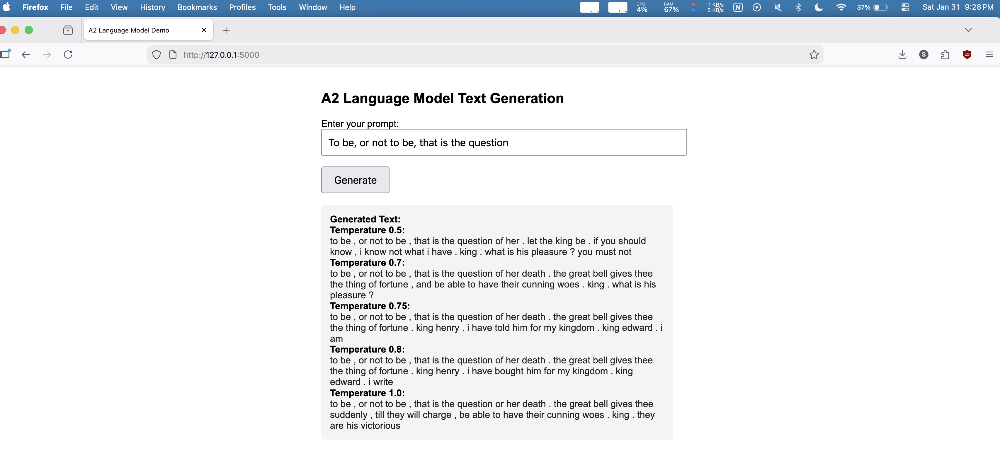
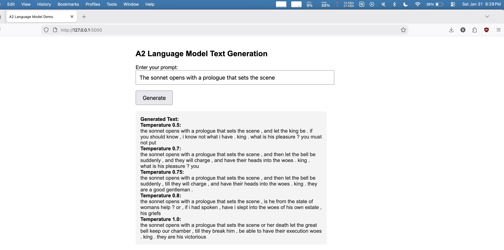
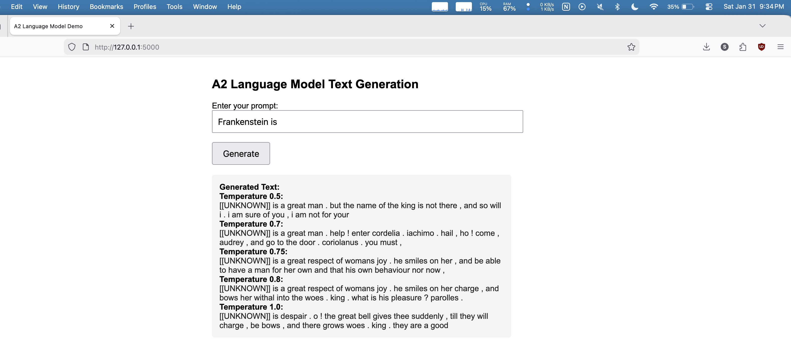

# Task 3 - A2 : Language Model - Web Application Development 

## Folder structure
```
A2/
├── app/
│   └── app.py - Web Application code using Flask framework 
│   └── lstm.py - LSTMLanguageModel class
│   └── tokenizer.py - basic_english_tokenizer function
│   └── vocab.py - Vocab class
├── model   - models and checkpoint location
│   └── a2_vocab_lm.pkl - Vocab pickle file
│   └── lstm_lm_checkpoint.pt - Checkpoint for LSTM model
├── code
│   └── class - notebooks from NLP class
│       ├── figures
│       │   └── LM.png
│       └── LSTM LM.ipynb
├── data/  
│   └── gutenberg_pg100.txt - Shakespeare's 44 creation in raw text file
├── img/ - images 
├── READING_NOTES.md - extra search on topics
├── README.md
└── resoruces
    └── A2_Language_Model.pdf - Assignment detail
```

## Web Application Development

### Python file list

1. `app.py` – Main entry point for the web app. Handles routing, user input, model loading, and text generation logic. 

        Run with 
        ```sh
        uv run app.py 
        # or 
        python app.py
        ```

2. `lstm.py` – Contains the LSTMLanguageModel class, which defines the neural network architecture for the language model.
3. `tokenizer.py` – Implements the basic_english_tokenizer function, a custom tokenizer compatible with your codebase and Python 3.13+.
4. `vocab.py` – Defines the Vocab class for vocabulary management, including token-to-index and index-to-token mappings, and special token handling.

### Model and Checkpoints: 

`A2/model/` - Model is stored as checkpoints and later checkpoint is loaded and built model to serve request from users.

### Security notes:

- Use `safe` to render HTML code, Jinja2 blocks the dynamically created HTML code. Need to take caution to trim out html code entered by users.
- For the same Jinja2 safety feature, <unk> is skipped, a special treatment is done to convert <unk> to `[[UNKNOWN]]`

### Screenshots for 4 cases

1. Prompt 1 : Shakespeare work related
    > Prompt used: To be, or not to be, that is the question

    

2. Prompt 2: One more test with Shakespeare work related
    > Prompt used: The sonnet opens with a prologue that sets the scene

    

3. Prompt 3 : to check missing token case 
    > Prompt used: Frankenstein is

    

4. Prompt 4: New creation using Shakespeare data
    > Prompt used: The meaning of life

    


# Other Learnings

## Add New packages

1. datasets (Hugging Face) — Most Popular for NLP

```bash
uv add datasets
```

What it provides:
- Huge collection of NLP datasets
- Easy streaming for large datasets
- Works seamlessly with transformers

2. torch is PyTorch — one of the most popular deep learning frameworks.

```
uv add torch
```

What it provides:
- Tensors	GPU-accelerated arrays (like NumPy but on GPU)
- Autograd	Automatic differentiation for gradients
- Neural Networks	torch.nn module for building models
- Optimizers	SGD, Adam, etc. in torch.optim
- GPU Support	CUDA acceleration with .to('cuda')


## Troubleshoot

### TypeError: build_vocab_from_iterator() got an unexpected keyword argument 'min_freq'

It's happened because `torchtext` version is 0.6.0. `min_freq` is only available in v0.12+

⚠️ Important Note on torchtext:
torchtext is deprecated! As of PyTorch 2.1+ (late 2023), torchtext is no longer actively maintained.

Upgrading  `torchtext` won't work if you have Python v3.13. Newer version of `torchtext` is available only for Python v 3.12 or below.

```
torchtext-0.18.0-cp312-cp312-macosx_11_0_arm64.whl
    │        │      │     │         │
    │        │      │     │         └── Platform (macOS ARM64)
    │        │      │     └── Python ABI
    │        │      └── CPython 3.12
    │        └── Version
    └── Package name
```

What is a Wheel?
A wheel (.whl) is Python's pre-built package format — like a ready-to-install app vs. building from source code.

|Tag |	Meaning|
| --- | --- | --- |
|cp312|	CPython 3.12|
|cp313|	CPython 3.13|
|macosx_11_0_arm64|	macOS 11+ on Apple Silicon|
|manylinux|	Works on most Linux distros|
|win_amd64|	Windows 64-bit|
|py3-none-any|	Pure Python, works everywhere |


PyTorch deprecated torchtext because:

- Hugging Face won the NLP tooling war 
- Maintenance burden - Maintaining two ecosystems wasn't worth it
- They assumed everyone uses transformers now
- Features duplicated by better libraries


Solution:
1. Pin your python to v3.12
2. Refactor the code not to use torchtext 

## How to execute python notebook 

```bash
uv run jupyter execute "code/class/LSTM LM.ipynb"
```


## Using GPU high and hot

Monitor GPU usage: 

```
sudo powermetrics --samplers gpu_power -i 1000 -n 1

# Continuous monitoring
sudo powermetrics --samplers gpu_power -i 1000
```

GPU info
```
system_profiler SPDisplaysDataType
```

Powermetrics GPU Output Explained

GPU HW active frequency	 -  Current GPU clock speed. Ex. 1002 MHz
GPU HW active residency	- GPU is 100% busy (actively working) ex. 100.00%
GPU idle residency - GPU is NOT idle (0% idle = fully utilized) Ex. 0.00%
GPU Power - Watts being consumed Ex. 19304 mW => ~19.3 Watts being used

```
GPU HW active frequency: 1002 MHz
GPU HW active residency: 100.00% (338 MHz:   0% 618 MHz:   0% 796 MHz:   0% 924 MHz:  41% 952 MHz:   0% 1056 MHz:  59% 1062 MHz:   0% 1182 MHz:   0% 1182 MHz:   0% 1312 MHz:   0% 1242 MHz:   0% 1380 MHz:   0% 1326 MHz:   0% 1470 MHz:   0% 1578 MHz:   0%)
GPU SW requested state: (P1 :   0% P2 :   0% P3 :   0% P4 :   0% P5 :   0% P6 :   0% P7 :   0% P8 :   0% P9 :   0% P10 : 100% P11 :   0% P12 :   0% P13 :   0% P14 :   0% P15 :   0%)
GPU SW state: (SW_P1 :   0% SW_P2 :   0% SW_P3 :   0% SW_P4 :  41% SW_P5 :  59% SW_P6 :   0% SW_P7 :   0% SW_P8 :   0% SW_P9 :   0% SW_P10 :   0% SW_P11 :   0% SW_P12 :   0% SW_P13 :   0% SW_P14 :   0% SW_P15 :   0%)
GPU idle residency:   0.00%
GPU Power: 19304 mW
```

1. GPU Power (Most Important)
```
GPU Power: 19304 mW = 19.3 Watts
```
Low (idle): 0-5W
Medium (light use): 5-15W
High (ML training): 15-30W ← You are here
Max (M3 Pro): ~40W

2. GPU HW active residency
```
100.00% = GPU is fully busy
  0.00% = GPU is completely idle
```
Your 100% means GPU is working hard (training the model).

3. Frequency breakdown

```
924 MHz: 41% | 1056 MHz: 59%
```

GPU spent 41% of time at 924 MHz and 59% at 1056 MHz.
Higher MHz = more performance = more power = more heat.


```bash
brew install --cask stats
```


