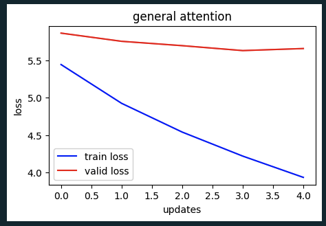
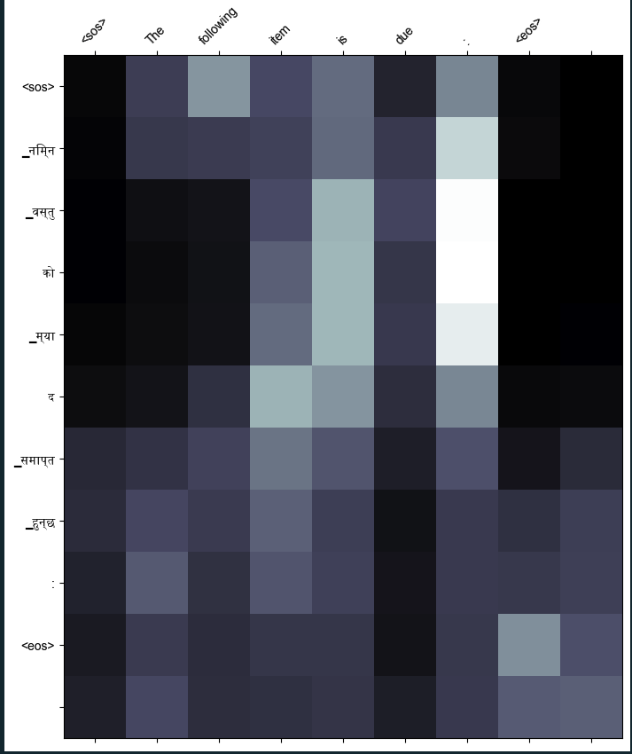
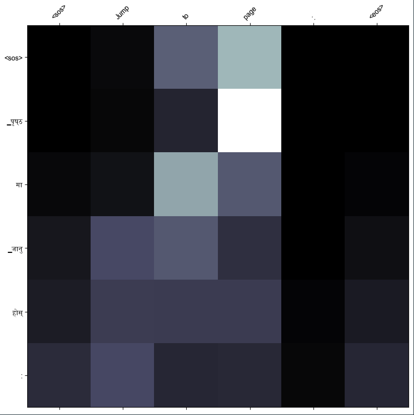
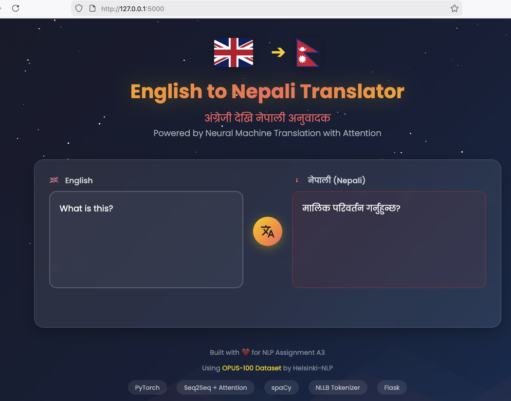
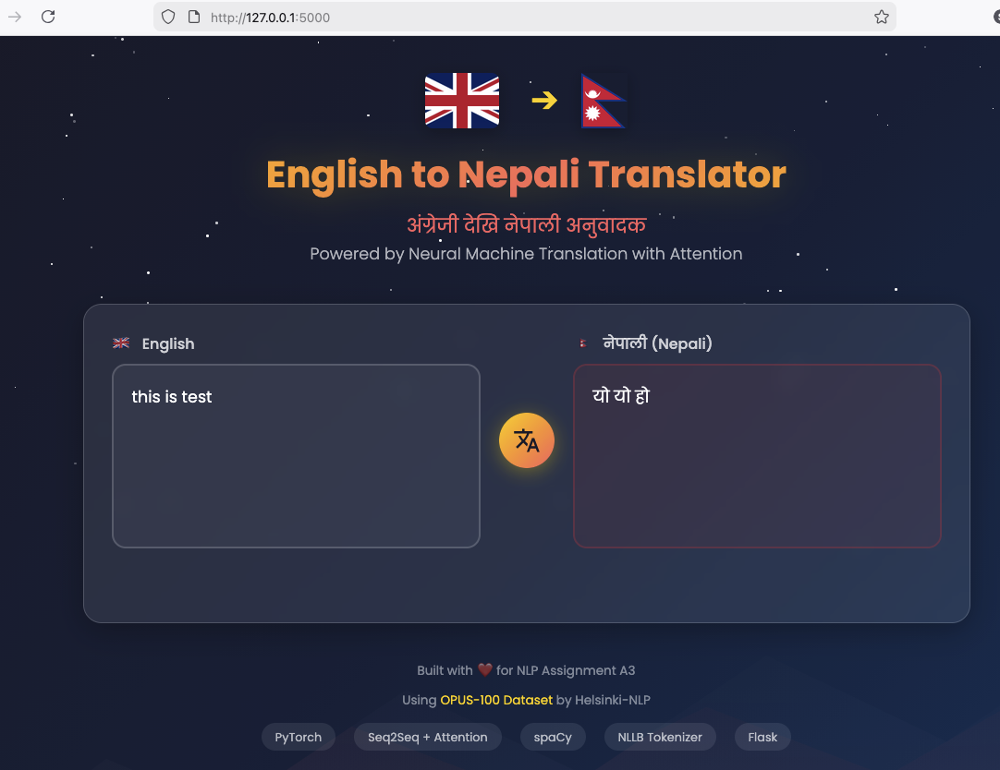
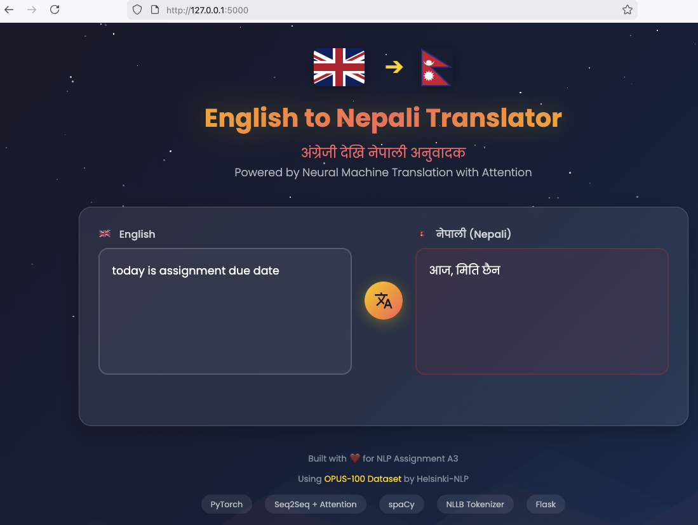

# A3: Make Your Own Machine Translation Language

## Performance metrics for General and Additive Attention mechanism

| Attention Type  | Model Size (MB) | Parameter count | Avg. Inference Speed | Throughput |Val Loss | Avg Training time (5 epochs)|
|-----------------|-----------------|-----------------|----------------------|------------|----------|-----------------------------|
| General         |      23.21  $\checkmark$    |  6,083,569 $\checkmark$     |        15.77 ms     | 63.41|   5.636  |     2m 5.2s    $\checkmark$             |
| Additive        |      23.47      |  6,149,617      |      13.12 ms  $\checkmark$       | 76.22 $\checkmark$|   5.589 $\checkmark$ |     2m 17.4s                |

Throughput is words inferred in 1 second. This is inverse of Inference speed. Higher the better model performance.


Comparison between General and Additive:

1. Additive model is ~1% larger in size and parameter.
2. Additive is still faster (0.02s vs 0.025s) than General by fraction of sectonds
3. Additive has better accuracy (i.e. lower validation loss 5.589 vs 5.639) 
4. Average training time for additive is higher (2m 17s vs 2m 5s)

Since accuracy, inference speed and throughput for Additive is better, Additive wins these performace metrics. 

**Recommendation:** Additive attention is recommended as it provides better accuracy, faster inference speed, and higher throughput—key factors that directly impact user experience.

## Performance Plots showing training and validation loss

[Additive Attention](../A3/imgs/additive_attention_plot.png)


[General Attention](../A3/imgs/general_attention_plot.png)


Loss Analysis:

|Attention Type	|Final Train Loss|Final Val Loss |Gap (Val - Train)| Observation                |
|---------------|----------------|---------------|-----------------|----------------------------|    
|General	    | 4.766	         | 5.636	     | 0.87	           | Moderate overfitting.      |
|Additive	    | 4.701	         | 5.589	     | 0.89	           | Slightly better performance|

Key Observations:

1. Additive attention performs better interms of loss — lowest training loss (4.701) and validation loss (5.589)

2. All models show overfitting — validation loss is ~0.9 higher than training loss, indicating the models memorize training data better than generalizing

3. Similar convergence patterns — all attention mechanisms converge at similar rates


## Vaidation and Perplexity number comparison

| Attention Type | Training Loss | Training PPL | Validation Loss | Validation PPL |
|----------------|---------------|--------------|-----------------|----------------|
| General        |   4.766       |   117.409    |      5.636      |    280.341     |
| Additive       |   4.701       |   110.076    |      5.589      |    267.469     |

Key obserbations:

- Losses are still high - PPL (perpexity) of 267-280 means the model is still quite "confused". Good translation mode perplexity expected below 100.

## Obersvations on Additive Attention

#### Translation 1:





Key Observations on Translation 1:

- The heatmap (bone color => white to high, black to low) for Translation 1 shows that model could not learn properly. Almost all token attend to wrong source positions. This makes sense from the PPL score - that being very high over 250. 
- The translation provided is itself noisy, the word like `due` captured literal meaning `_समाप्त` but didn't get the context. According to context, `due` mapping is semantically wrong.
- Since white or light colored cells is aligned towards center, model seems to have positional bias rather than learned alignment.

#### Translation2: 




Key Observations on Translation 2:

- Provided translated text is right. 
- The model has been able to learn and map `page` to `_पृष्ठ` correctly.


In summary, Model did not learn proper attention - unable to capture semantic meaning , shows positional bias.


## Task 4: Web Application using Flask

### Overview

A Flask-based web application was developed to showcase the English-to-Nepali machine translation model. The application provides an interactive interface where users can input English text and receive Nepali translations in real-time.

(Disclaimer: templating is done using vibe coding..)

**Screenshots of the Web Application:**







### Features

1. **Input Box for Source Language**: Users can enter English sentences or phrases in a text area input field.

2. **Translation Output Display**: The translated Nepali text is displayed in a separate output area with proper Devanagari script rendering.

3. **Themed UI**: Nepal-inspired design with mountain background, flag imagery, and cultural aesthetics.

### How the Web Application Interfaces with the Language Model


#### Step-by-Step Interface Process

**1. User Input (Frontend → Backend)**
```javascript
// User enters text in input box and clicks "Translate"
// JavaScript sends POST request to /translate endpoint
fetch('/translate', {
    method: 'POST',
    headers: {'Content-Type': 'application/json'},
    body: JSON.stringify({text: englishText})
})
```

**2. Text Preprocessing (Backend)**
```python
# Flask receives the request
@app.route('/translate', methods=['POST'])
def translate():
    data = request.get_json()
    english_text = data.get('text', '')
    translation, _ = translate_sentence(english_text)
    return jsonify({'translation': translation})
```

**3. Tokenization**
```python
# spaCy tokenizes English input
tokens = [tok.text.lower() for tok in spacy_model(sentence)]

# Convert tokens to indices using vocabulary
src_indices = [SOS_IDX] + vocab_src(tokens) + [EOS_IDX]
src_tensor = torch.LongTensor(src_indices).unsqueeze(1).to(device)
```

**4. Model Inference ( Addivite Attention )**
```python
# Encoder processes source sentence
encoder_outputs, hidden = model.encoder(src_tensor, src_len)

# Decoder generates translation token-by-token
for _ in range(max_len):
    output, hidden, attention = model.decoder(trg_tensor, hidden, encoder_outputs, mask)
    pred_token = output.argmax(1).item()  # Get most probable token
    trg_indices.append(pred_token)
    if pred_token == EOS_IDX:  # Stop at end token
        break
```

**5. Post-processing and Response**
```python
# Convert indices back to Nepali tokens
trg_tokens = [vocab_trg.get_itos()[idx] for idx in trg_indices[1:-1]]

# Handle NLLB subword tokens (remove ▁ markers)
translation = "".join(trg_tokens).replace("▁", " ").strip()

# Return JSON response to frontend
return jsonify({'translation': translation, 'original': english_text})
```

**6. Display Result (Frontend)**
```javascript
// JavaScript receives response and updates UI
.then(data => {
    document.getElementById('nepaliOutput').textContent = data.translation;
})
```

### Key Components

| Component | File | Purpose |
|-----------|------|---------|
| Flask Server | `app/app.py` | Handles HTTP requests, loads model, processes translations |
| HTML Template | `app/templates/index.html` | User interface with input/output areas |
| Model | `models/Seq2SeqPackedAttention_additive.pt` | Trained Seq2Seq with Additive Attention weights |
| Vocabularies | `models/vocabs.pt` | Source (English) and Target (Nepali) vocabularies |

### Running the Application

```bash
cd A3/app
uv run app.py
# Server starts at http://localhost:5000
```

## Folder structure
```
A3/
├── app/
│   └── app.py - Web Application code using Flask framework 
│   └── template/index.html - Vibe coding done for template
├── model   - models generated are saved here. models are not pushed to remote as push get slower. 
├── code
│   └── a3.ipynb - Assignment solutions
├── data/  
│   └── 
├── imgs/ - images and screenshots
├── NOTES.md - extra search on topics
├── README.md
└── resources - pdfs 


```

### Create folder structure

```sh

mkdir app code data img model resources
touch README.md
touch NOTES.md

```