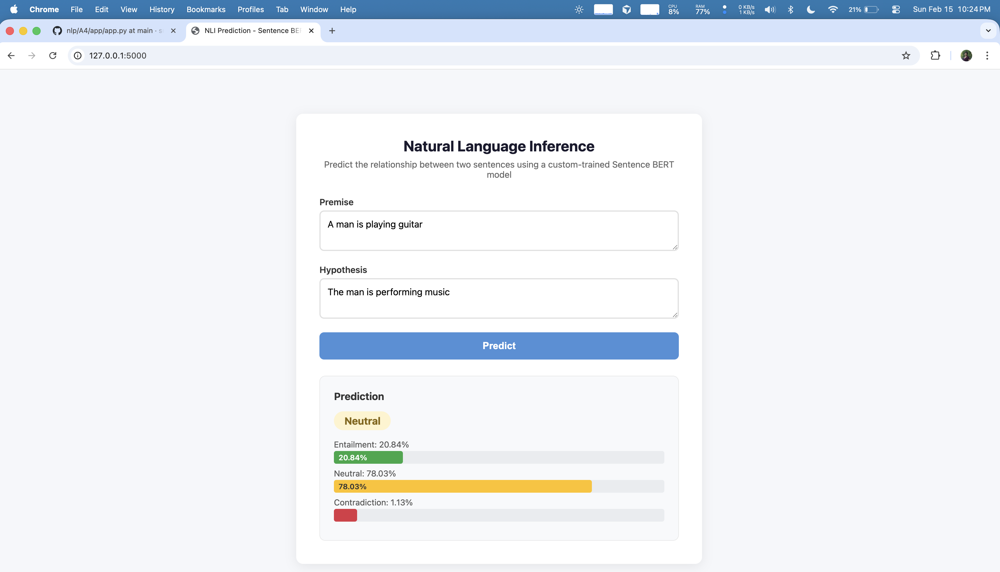
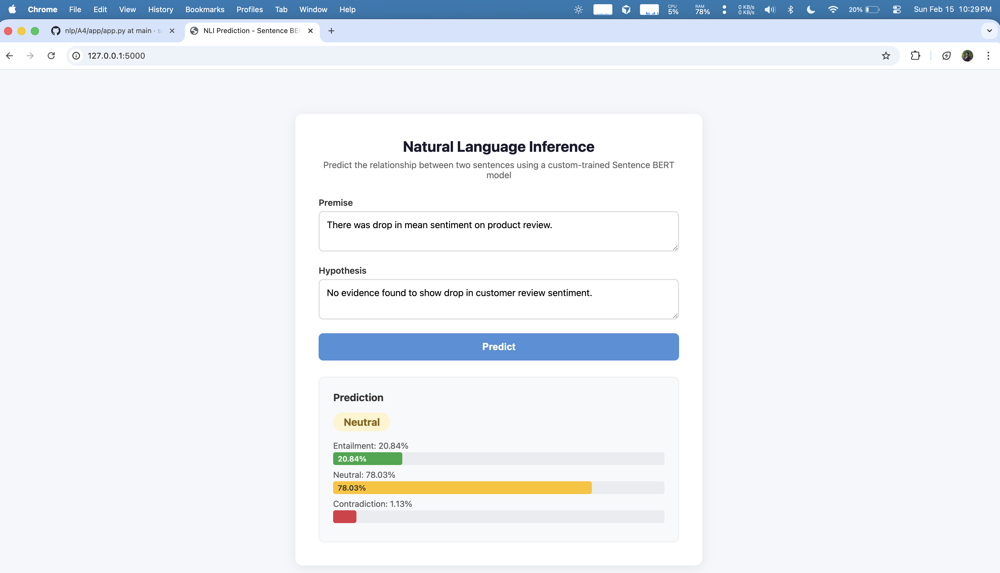
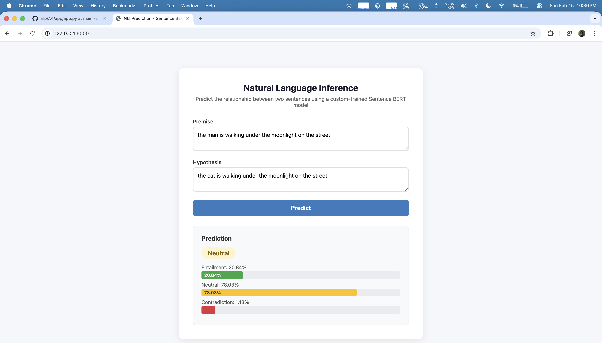

# A4


Task (entailment, neutral and contradiction).

## 1. Test 1 - Similar meaning

- Premise: A man is playing a guitar on stage.
- Hypothesis: The man is performing music.
- Label: Entailment




## 2 Test 2 - Opposite meaning

- Premise: There was drop in mean sentiment on product review. 
- Hypothesis: No evidence found to show drop in customer review sentiment.
- Label: Contradiction



## 3. Test 3 - Neutrl

- Premise: The man is walking under the moon on the street.
- Hypothesis: The man is walking under the moon on the street.
- Label: Neutral



## Folder structure

```sh
A4/
├── app
├── code
├── data
├── images
├── modes
├── NOTES.md
├── README.md
└── resources
```

