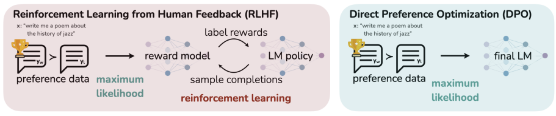

# NOTES

# Summary of [DPO](https://arxiv.org/pdf/2305.18290)

## What Problem Does DPO Solve?

Large language models learn from massive internet data, but that data contains both good and bad content. We need ways to steer these models toward producing helpful, safe outputs that align with human preferences. The standard approach — RLHF (Reinforcement Learning from Human Feedback) — works but is complex and unstable. It requires training a separate reward model, then using RL (typically PPO) to optimize the language model against that reward. This involves multiple models, sampling from the policy during training, and careful hyperparameter tuning.



## The Key Insight

The authors discovered a mathematical trick: you can rearrange the equations of the standard RLHF objective so that the reward model is expressed *in terms of the policy itself*. Specifically, the reward can be written as:

**r(x, y) = β · log[π(y|x) / π_ref(y|x)]**

This means any language model *implicitly defines* a reward model when compared against a reference model. So instead of training a reward model separately and then doing RL, you can directly optimize the policy using a simple classification loss.

## How DPO Works (The Pipeline)

1. Start with an SFT (supervised fine-tuned) model as your reference policy
2. Collect preference data: pairs of responses where humans indicate which is better (y_w preferred over y_l)
3. Optimize a single cross-entropy loss that increases the likelihood of preferred responses and decreases the likelihood of dispreferred ones, weighted by how "wrong" the implicit reward model currently is

The loss function looks like a logistic regression — it takes the log-probability ratios of preferred vs. dispreferred completions (relative to the reference model) and passes them through a sigmoid. That's it. No RL loop, no separate reward model, no sampling during training.

## Why the Weighting Matters

DPO isn't just naively boosting preferred responses and suppressing dispreferred ones. It includes a dynamic importance weight: examples where the implicit reward model is most wrong get the highest gradient signal. Without this weighting, the model degenerates (the paper shows this in their ablations).

## Theoretical Contributions

The authors prove that their reparameterization doesn't lose any expressiveness — every possible reward function class can be represented this way. They also show that reward functions differing only by a prompt-dependent constant are "equivalent" (they produce the same preference distribution and the same optimal policy), and DPO selects exactly one canonical member from each equivalence class.

## Experimental Results

They tested on three tasks:

**Controlled sentiment generation** (IMDb reviews → positive sentiment): DPO achieved the best reward-vs-KL tradeoff frontier, outperforming PPO even when PPO had access to ground-truth rewards.

**Summarization** (Reddit TL;DR): DPO reached ~61% win rate against human references at temperature 0, beating PPO's best of ~57%. DPO was also more robust to sampling temperature changes.

**Single-turn dialogue** (Anthropic HH dataset): DPO was the only computationally efficient method that improved over the preferred completions in the dataset.

They also showed DPO generalizes well out-of-distribution (trained on Reddit, tested on CNN/DailyMail news articles) and validated that GPT-4 evaluations correlate well with human judgments.

## Key Takeaways

- DPO reformulates RLHF as a simple classification problem by recognizing that the optimal policy and reward model are mathematically linked
- It optimizes the *same objective* as standard RLHF but without needing RL, a separate reward model, or policy sampling during training
- It's simpler to implement (the paper includes a ~15-line PyTorch implementation), more stable, and performs comparably or better than PPO-based RLHF
- The core mathematical move is a "change of variables" from reward space to policy space, leveraging the closed-form solution of the KL-constrained reward maximization problem

## Making MPS Deterministic in PyTorch
MPS (Metal Performance Shaders) on Apple Silicon has limited determinism support compared to CUDA. Here's what you can do:

```python
import torch
import os
import random
import numpy as np

def set_seed(seed: int = 42):
    random.seed(seed)
    np.random.seed(seed)
    torch.manual_seed(seed)
    
    # MPS-specific
    torch.mps.manual_seed(seed)
    
    # These help with determinism (may impact performance)
    os.environ["PYTHONHASHSEED"] = str(seed)

set_seed(42)

```

Key caveats for MPS:

- torch.use_deterministic_algorithms(True) — MPS has partial support only; some ops will raise errors if not implemented deterministically
- Unlike CUDA, there's no torch.backends.mps.deterministic flag
- Some ops (e.g., scatter, certain convolutions) may still be non-deterministic on MPS

Safer approach — use deterministic mode with fallback:

```python
import torch
import os

def set_deterministic(seed: int = 42):
    torch.manual_seed(seed)
    torch.mps.manual_seed(seed)
    os.environ["PYTHONHASHSEED"] = str(seed)
    
    # Only enable if your ops support it; wrap in try/except
    try:
        torch.use_deterministic_algorithms(True)
    except Exception as e:
        print(f"Full determinism not available: {e}")

set_deterministic(42)
```

Practical notes:

- Setting the seed before each training run is the most reliable approach
- True bit-for-bit reproducibility on MPS is not always guaranteed, even with seeds set
- If reproducibility is critical, consider running on CPU for debugging


## DPO Trainer

DPO (Direct Preference Optimization) is a fine-tuning method for aligning LLMs with human preferences — a simpler alternative to RLHF (Reinforcement Learning from Human Feedback).

### How it works
Instead of training a separate reward model + PPO loop (RLHF), DPO directly optimizes the language model using preference pairs:

` (prompt, chosen_response, rejected_response)`

It uses a closed-form loss derived from the Bradley-Terry preference model:


`L_DPO = -E[ log σ( β * log(π_θ(y_w|x)/π_ref(y_w|x)) - β * log(π_θ(y_l|x)/π_ref(y_l|x)) ) ]`

Where:

- π_θ = model being trained
- π_ref = frozen reference model (usually the SFT checkpoint)
- y_w = chosen (preferred) response
- y_l = rejected (less preferred) response
- β = temperature controlling deviation from reference

### DPOTrainer (from TRL library)

```python
from trl import DPOTrainer, DPOConfig

training_args = DPOConfig(
    beta=0.1,               # KL penalty coefficient
    output_dir="./dpo_output",
    per_device_train_batch_size=4,
    num_train_epochs=3,
    learning_rate=5e-5,
)

trainer = DPOTrainer(
    model=model,            # model to train
    ref_model=ref_model,    # frozen reference model (or None for implicit ref)
    args=training_args,
    train_dataset=dataset,  # needs: prompt, chosen, rejected columns
    tokenizer=tokenizer,
)

trainer.train()
```

Required dataset format

```python
{
    "prompt": "What is the capital of France?",
    "chosen": "The capital of France is Paris.",
    "rejected": "I don't know the capital of France."
}
```
vs RLHF

| |RLHF	|DPO|
Reward model	Required	Not needed
RL training	PPO	No RL, direct loss
Stability	Tricky	More stable
Simplicity	Complex	Simple
DPO is widely used for preference alignment because it's stable, simple, and avoids the complexity of RL training loops.


## LoRA (Low-Rank Adaptation)
LoRA is a parameter-efficient fine-tuning technique. Instead of updating all model weights during fine-tuning, it freezes the original weights and injects small trainable matrices alongside them.

The math: For a weight matrix W, LoRA adds W + ΔW where ΔW = A × B (two low-rank matrices). Only A and B are trained — dramatically fewer parameters.

```
Original:  W (d × d)  →  d² parameters
LoRA:      A (d × r) + B (r × d)  →  2·d·r parameters  (where r << d)
```

Config Explained

```
peft_config = LoraConfig(
    task_type=TaskType.CAUSAL_LM,   # Task: causal language modeling (GPT-style next-token prediction)
    r=8,                            # Rank of the low-rank matrices (r=8 → small, memory-efficient)
    lora_alpha=16,                  # Scaling factor: effective scale = alpha/r = 16/8 = 2.0
    lora_dropout=0.05,              # 5% dropout on LoRA layers (regularization)
    target_modules=["q_proj",       # Only adapt Query projection
                    "v_proj"],      # ...and Value projection in attention layers
    bias="none",                    # Don't train bias terms
)
```

| Parameter       | Value        | Meaning                                                        |
|-----------------|-------------|----------------------------------------------------------------|
| r               | 8           | Rank — smaller = fewer params, less expressiveness             |
| lora_alpha      | 16          | Controls update magnitude; scale = alpha/r = 2.0               |
| lora_dropout    | 0.05        | Prevents overfitting in LoRA layers                            |
| target_modules  | q_proj, v_proj | Only attention Q/V matrices (not K, output, FFN)           |
| bias            | none        | Biases stay frozen                                             |

Why q_proj and v_proj only? This is a common lightweight choice — Q and V control what to attend to and what to extract. Skipping K, output projections, and FFN layers saves memory while retaining most fine-tuning benefit.

Trainable params estimate: With r=8 targeting only Q+V, you're typically training ~0.1–1% of total model parameters vs full fine-tuning.

