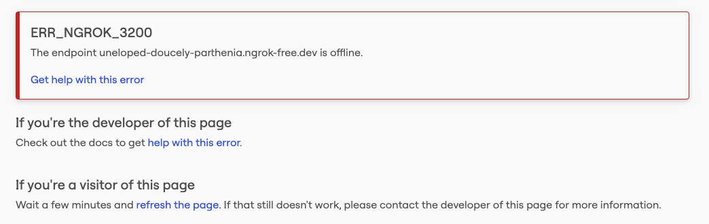

#NOTES

## ERR_NGROK_3200

```
ERR_NGROK_3200
The endpoing abc-123.ngrok.free.dev is offline

Get hep with error
```



Resolution: 
- Fix WEBHOOK_URL in n8n docker-compose.yml file.
- After adding the URL , restart the docker.

n8n is running. Now check these 3 things one by one:

1. Is ngrok running?
Open a terminal and check — you should see a screen like:


Forwarding  https://uneloped-doucely-parthenia.ngrok-free.app -> http://localhost:5678
If that terminal was closed, ngrok stopped. Run it again:


ngrok http 5678
2. Is the MCP Server workflow Active?
In n8n → open the MCP Server workflow → confirm the toggle says Active (not Inactive)

3. What is the exact error?

Is it in the browser when visiting the SSE URL?
Or is it inside n8n in the MCP Client node?

### Workflow could not be published:
Unrecongnized node type.

# Task 1. MCP Infrastructure & Server Setup

N8N Docker installation Guide - https://docs.n8n.io/hosting/installation/docker/


## Step 1 Docker + ngrok setup

### Starting n8n

From terminal , run folwong commands, replace the timezone placeholder with your timezone

```sh
docker volume create n8n_data

docker run -it --rm \
 --name n8n \
 -p 5678:5678 \
 -e GENERIC_TIMEZONE="<YOUR_TIMEZONE>" \
 -e TZ="<YOUR_TIMEZONE>" \
 -e N8N_ENFORCE_SETTINGS_FILE_PERMISSIONS=true \
 -e N8N_RUNNERS_ENABLED=true \
 -v n8n_data:/home/node/.n8n \
 docker.n8n.io/n8nio/n8n
```

### Alternative use docker-compose.ym

- Write docker-compose.yml
- Write mcp_server_wrokflow.json


### Docker debuggin

```sh
docker ps --filter name=n8n --format "table {{.Names}}\t{{.Status}}\t{{.Ports}}" 
```

```sh
docker exec n8n n8n --version
```


### Request timeout issue on MCP Client

Then in the MCP Client node, change the endpoint to:

```
http://localhost:5678/mcp/mcp-server
```
This works because both the MCP Client and MCP Server run inside the same n8n container — no need to go through ngrok at all. The ngrok URL is only needed for external connections like Telegram.


### Check if telegram bot connection is working

Verify response https://api.telegram.org/PERSONAL_TELEGRAM_AP_KEY/getWebhookInfo


### Tunnelling

https://www.youtube.com/watch?v=RvAD2__YYjg 


### Copy docker data 

```sh
docker cp n8n:/home/node/.n8n/. ./A7/docker/n8n_data

```

