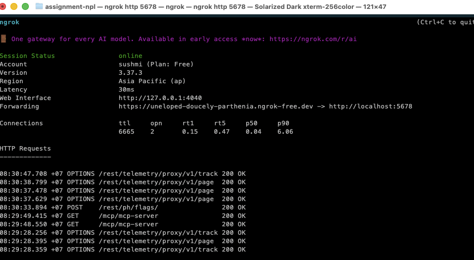
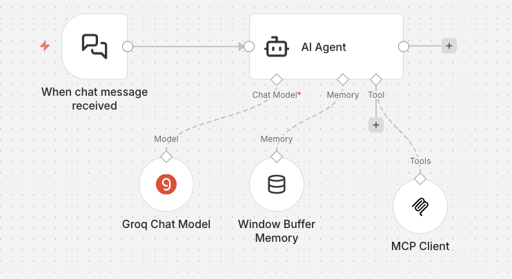
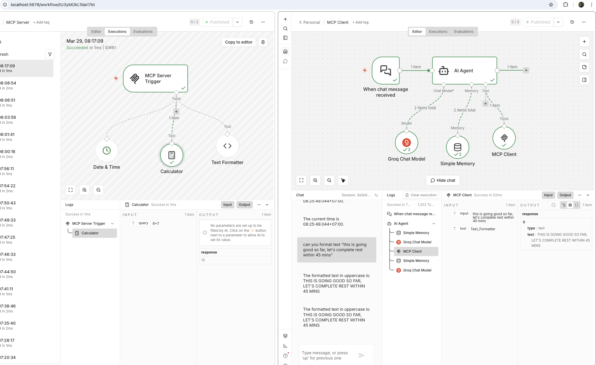
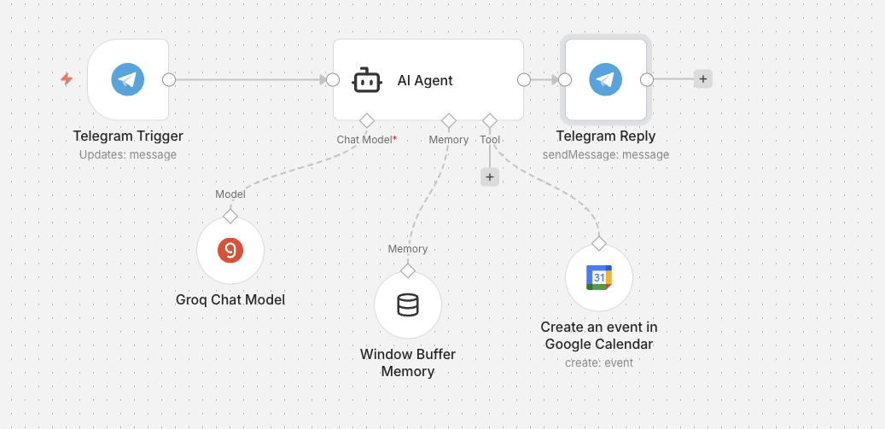
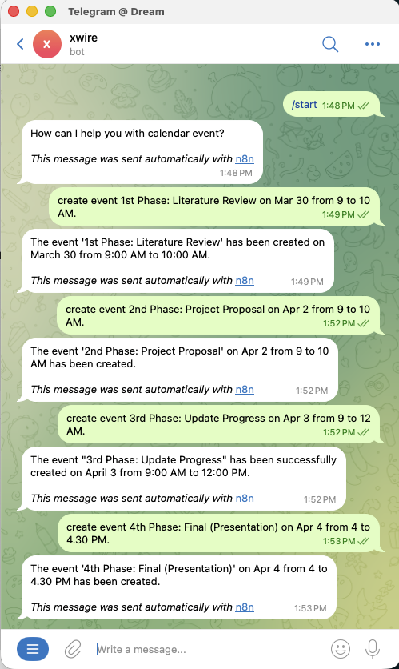
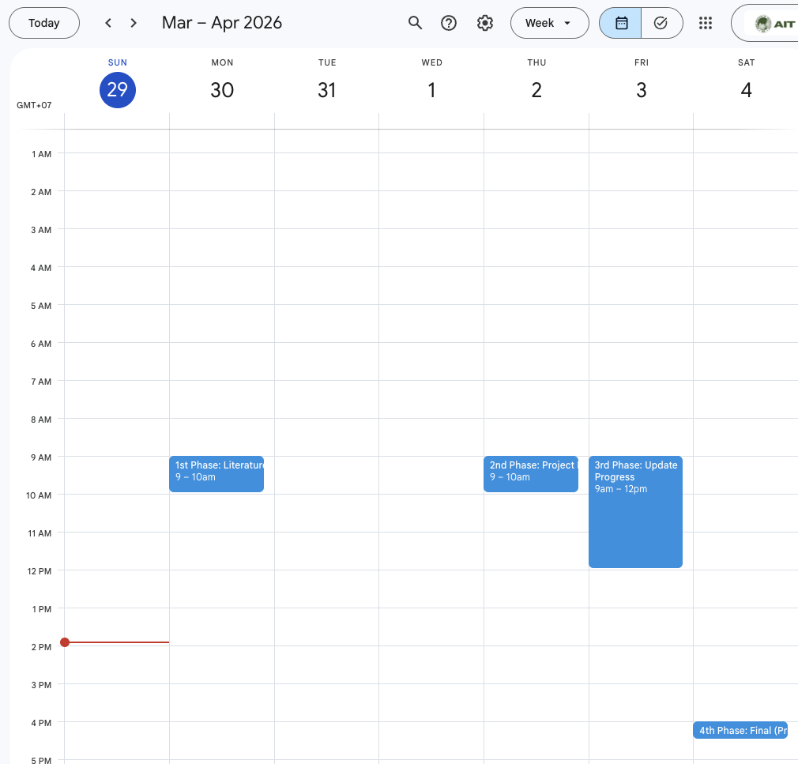

# A7: MCP-Server, AI Agent & External Tool Integration

## Prerequisites

- Docker Desktop installed and running
- ngrok account (free tier used): [https://ngrok.com](https://ngrok.com)
- Groq API key (free): [https://console.groq.com](https://console.groq.com)
- Telegram account
- Google account

---

## Task 1 - MCP Infrastructure & Server Setup

### Step 1.1 - Start n8n with Docker

```bash
cd A7/docker
docker compose up -d
```

Open n8n at: [http://localhost:5678](http://localhost:5678)  
Create admin account on first launch.

---

### Step 1.2 - Expose n8n with ngrok

Install ngrok and authenticate:

```bash
brew install ngrok           # macOS
ngrok config add-authtoken PERSONAL_NGROK_TOKEN
ngrok http 5678
```

Copy the **Forwarding URL** (e.g. `https://abc-123.ngrok-free.dev`). 

Update n8n's webhook URL:

- Set Fowarding or **Webhook URL** to ngrok URL in docker-compose.yml  
e.g. `https://abc123.ngrok-free.app`

```
services:
   environment:
      - WEBHOOK_URL=https://abc-123.ngrok-free.dev/

```

- Save and **restart n8n**:
  ```bash
  docker compose restart n8n
  # OR docker compose down && docker compose up -d
 
  ```



---

### Step 1.3 - Import MCP Server Workflow

1. In n8n, click **+** (New Workflow) 
2. Click **Publish** (toggle top-right) 
3. Note the Production URL shown on the MCP Server Trigger node:
  - It will something like : `https://abc-123.ngrok-free.dev/mcp/mcp-server/sse`

This workflow exposes **3 MCP tools**:


| Tool             | Description                            |
| ---------------- | -------------------------------------- |
| `calculator`     | add / subtract / multiply / divide (Inbuilt node)    |
| `get_datetime`   | current date & time with timezone  (Inbuilt node)    |
| `text_formatter` | only uppercase supported  (JS Code node)             |


---

### Step 1.4 - Set up Groq API Credential

1. Go to [https://console.groq.com](https://console.groq.com) → **API Keys** → Create key

---

### Step 1.5 - Import AI Agent Chat Workflow

1. Create Groq chat model workflow



2. Open the Groq Chat Model node in your workflow
3. Click the Credential dropdown and Create new credential
4. Paste your Groq API key and Save
5. Open the **MCP Client** node and update the SSE endpoint to your real URL:
  ```
   https://abc-123.ngrok-free.dev/mcp/mcp-server/sse
  ```
3. Select your **Groq API** credential in the Groq Chat Model node
4. **Publish** the workflow
5. Click **Chat** (bottom-left) to open chat and test:
  - "What is time now?" → agent calls `get_datetime`
  - "2+5?" → agent calls `calculator`
  - "Make 'this is going good so far, let's complete rest within 45 mins' uppercase" → agent calls `text_formatter`



---

## Task 2 - Telegram & Google Calendar Integration

### Step 2.1 - Create Telegram Bot

1. Open Telegram → search **@BotFather**
2. Send `/newbot` → follow prompts → copy the **Bot Token**
3. In n8n: Add credentials to telegram node - **Settings → Credentials → + Add Credential**
4. Search **Telegram API** → paste Bot Token → Save

### Step 2.2 - Connect Google Calendar OAuth2

1. Go to [Google Cloud Console](https://console.cloud.google.com)
2. Create a new project (or use existing)
3. Search and Enable **Google Calendar API** (Consent OAuth too)
4. Go to **APIs & Services → Credentials → + Create Credentials → OAuth 2.0 Client ID**
  - Application type: **Web application**
  - Authorized redirect URIs: `https://PERSONAL_NGROK_URL/rest/oauth2-credential/callback`


### Step 2.3 - Import Telegram + Calendar Workflow

1. Create workflow with Telegram & Calendar
  - Copy **Client ID** and **Client Secret**
  - In n8n: **Settings → Credentials → + Add Credential**
  - Search **Google Calendar OAuth2 API** → paste Client ID & Secret → **Connect** → authorize with Google
  
  (Make sure you are logged on locally hosted n8n)

  Documentation for Google Calendar Event operation [here](https://docs.n8n.io/integrations/builtin/app-nodes/n8n-nodes-base.googlecalendar/event-operations/#create)

2. In each node, select your saved credentials:
  - **Telegram Trigger**: select Telegram Bot API credential
  - **Groq Chat Model**: select Groq API credential
  - **Google Calendar**: select Google Calendar OAuth2 credential
  - **Telegram Reply**: select Telegram Bot API credential
3. **Activate** the workflow
4. n8n will register a webhook with Telegram automatically



### Step 2.4 - Test via Telegram

Open Telegram -> find your bot -> send message:

```
Create a project schedule for my NLP assignment with 4 phases:
1. Literature Review
2. Project Proposal
3. Update Progress
4. Final Presentation

with start and end date and time
```

The agent will:

1. Parse the message request sent on Telegram bot
2. Call Google Calendar to create event with Summary, Description, Start and End datetime
3. Reply with a confirmation message in Telegram

### Step 2.5 - Verify on Google Calendar

Open [https://calendar.google.com](https://calendar.google.com) and confirm 4 events appear:

- Phase 1: Literature Review
- Phase 2: Project Proposal
- Phase 3: Update Progress
- Phase 4: Final (Presentation)

Message Drafted
```sh

create event 1st Phase: Literature Review on Apr 1 from 9 to 10 AM.
create event 2nd Phase: Project Proposal on Apr 2 from 9 to 10 AM.
create event 3rd Phase: Update Progress on Apr 3 from 9 to 12 AM.
create event 4th Phase: Final (Presentation) on Apr 4 from 4 to 4.30 PM.

```

Screenshots of:

1. The Telegram conversation



2. The Google Calendar with all 4 events visible



---

## Troubleshooting


| Issue                         | Fix                                                                  |
| ----------------------------- | -------------------------------------------------------------------- |
| MCP tools not found           | Ensure MCP Server workflow is **Published** and ngrok is running     |
| Agent doesn't respond in chat | Check Groq credential is selected in the AI Agent node               |
| Telegram webhook fails        | Make sure n8n's Webhook URL is set to the ngrok URL (not localhost)  |
| Google Calendar auth error    | Re-authorize OAuth2 credential; check redirect URI matches ngrok URL |
| ngrok URL changed             | Update Webhook URL in n8n Settings + MCP Client SSE endpoint         |


---

## Workflow Architecture

```
Task 1:
  [Chat UI] → [AI Agent] → [Groq LLM] + [Window Buffer Memory]
                                ↓
                          [MCP Client] → [MCP Server (ngrok)] → [Calculator | Date/Time | Text Formatter]

Task 2:
  [Telegram] → [AI Agent] → [Groq LLM] 
                                ↓
                       [Google Calendar Tool] → creates events
                ↓
          [Telegram Reply] → sends confirmation back to user
```

---

## Folder Structure

```
A7/
├── docker/
│   ├── .env # Environment variable including token
│   ├── docker-compose.yml
│   └── docker-compose-pg.yml
├── images/ # screenshots 
│   ├── add.png
│   ├── bot_create_message.png
│   ├── calendar_event.png
│   ├── err_ngrok_3200.png
│   ├── event_created.png
│   ├── ngrok_running_stat.png
│   ├── task1_2.png
│   ├── task1_5.png
│   ├── task1_5_1.png
│   └── task_2_3_telegram_calendar.png
└── workflows/ #workflows
│   ├── mcp_client_chat_workflow.json
│   ├── mcp_server_workflow.json
│   └── mcp_telegram_gcal_workflow.json
└── README.md # documentation on n8n usage and integrations
└── NOTES.md # Something worth remembering


```

